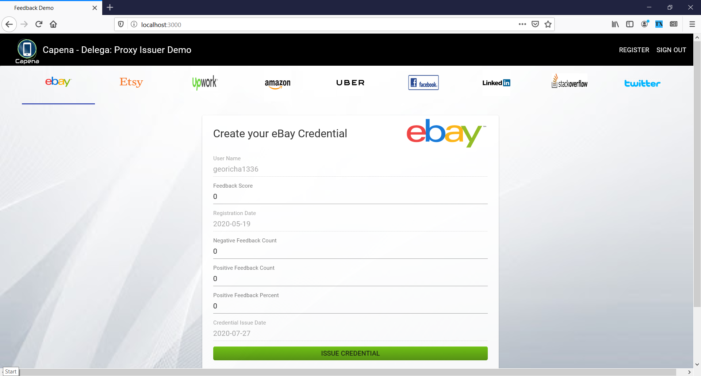
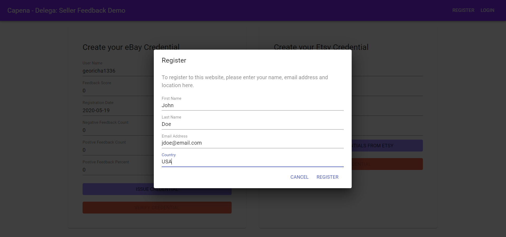
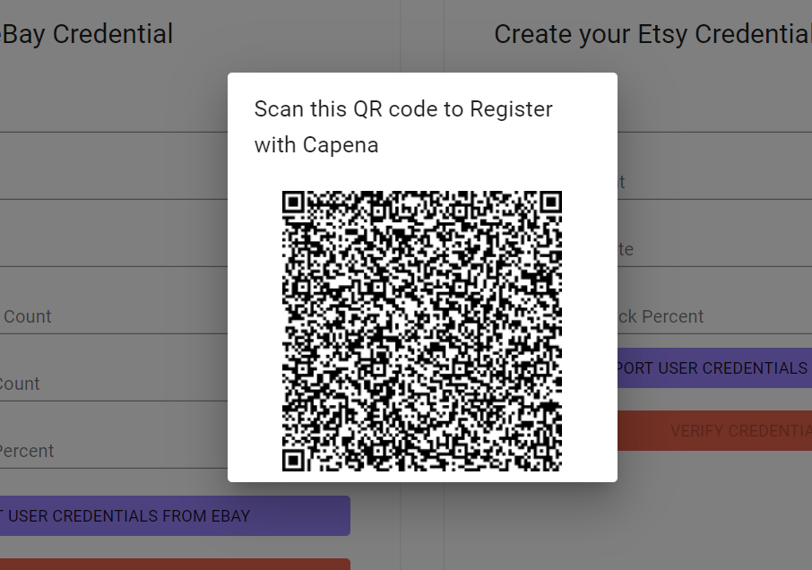

# Feedback API Quickstart

This is the Capena-Delega demo application which allows users to import reputation data from eBay and Etsy (with more to follow)
and then to have those credentials issued as digitally signed transactions on the Hyperledger Indy ledger. Users' data is then stored in their digital wallets allowing for reuse (transferrence) of those credentials to downstream verifiers.

The Capena-APPIA demo will show the interaction between the users and those downstream platforms.

This application, the upstream Capena-Delega Proxy Issuer, consists of a React front end client, and an expressjs server. The server uses third party nodejs clients to access eBay and Etsy APIs. These clients are @hendt/ebay-api and etsy-js respectively.

The Aries SSI agent communication uses the streetcred API.

# ExpressJS eBay and Etsy

There are two express modules which allow feedback to be imported from ebay and etsy. These are in /routes/ebay and /routes/etsy.

# Ebay Feedback API
The first endpoint that is invoked is a GET call to /auth/ebay. If this is the first time the app has accessed eBay it will display a login screen in which a valid eBay user needs to be entered. For most subsequent invocations this will not be needed, although it does display this when the user access token is expired (seems to be about once per day).

Note that the /auth/ebay returns a URL to the client app and the client app redirects across to that URL. Ideally that redirect would be done in Express but I was unable to get that to work due to a persistent CORS error which I couldn't fix. But a client side
redirect seems to work ok for now.

The ebay API itself will redirect successful access back the callback /auth/ebay/callback where i) the OAuth user token is exchanged for an access token, and ii) a call is made to the trading (getUser) API.

Once the eBay user data is retrieved successfully it should redirect back to the main app screen. The client application needs to make a GET call to the endpoint /api/ebay/feedback to retrieve the user data.

The example app uses the following fields from those returned:

    FeedbackScore
    UniqueNegativeFeedbackCount
    UniquePositiveFeedbackCount 
    PositiveFeedbackPercent
    FeedbackPrivate
    RegistrationDate 
    UserID

But there are many others that could be of use.

# Etsy Feedback API
The first endpoint that is invoked is a GET call to /auth/etsy. By default, unlike eBay, etsy will always display a login screen in which a valid etsy user needs to be entered. We could store this and reuse but it's not a priority right now.

The etsy API itself will redirect successful access back the callback /auth/etsy/callback where i) the OAuth user token is exchanged for an access token, and ii) a call is made to the User API to get the user data. 

    let user = authorisedClient.user("__SELF__");

    Here __SELF__ is replaced by the Etsy user who logged in (that is done automatically by Etsy's software).

Once the etsy user and password are entered it should redirect back to the main app screen. The client application needs to make a GET call to the endpoint /api/etsy/feedback to retrieve the user data.

The example app uses the following fields from those returned:

    UserID
    FeedbackCount
    PositiveFeedbackPercent 
    RegistrationDate

# utils Until() function

Both Etsy and Ebay use the utils.until() function to avoid race conditions. This is just a function that polls for a certain boolean expression to be satisfied before it releases the programme flow back to the caller via a resolved promise.

# Install and Run ngrok
To run the client app (for ebay) it is necessary to install and run the ngrok tunneling software so that webhook calls get routed correctly through to https://localhost:3002 (the express server port).

https://ngrok.com/download

Once installed run it with the command

./ngrok http https://localhost:3002

You will see something like

    Forwarding   https://650020e4.ngrok.io -> https://localhost:3002 

In the .env file change the NGROK key as follows:
    
    NGROK_URL='https://8049c8b1.ngrok.io'

# https SSL certificates

Either install and set linux to trust new SSL certificates and place in certs. There will need to be two
    server.crt
    server.key

As an alternative, in Chrome you can disable certificate authorization (fine for dev only). Go to

    chrome://flags/#allow-insecure-localhost

...and set "Allow invalid certificates for resources loaded from localhost" to DISABLED.

## Use Case
To see how the modules are used by a front end (React) application, refer to the code in /src/App.js

## Prerequisites:
- [npm](https://www.npmjs.com/get-npm)
## Install mobile wallet

### iOS
 1. If you are using iOS, download the [streetcred identity agent](https://apps.apple.com/us/app/streetcred-identity-agent/id1475160728)
 
### Android
 1. If you are using Android, download the app "Streetcred identity wallet" from Play Store

## Steps to issue a feedback credential: 

### Prepare issuer portal
 1. clone the repository
 `git clone https://github.com/euroledger/capena-delega.git`
 
 1. navigate into the directory
 `cd capena-delega`
 
 1. install the dependencies
 `npm install .`

 1. Open up the repository in a code editor of your choice

 
### Running the application
Assuming everything still works correctly, you are ready to run the application. 

- Run with npm
`npm run start`

- The main screen will be displayed:

    

- The first thing to do is register. Click on the toolbar link and fill out the form:

  

- If you're using the Streetcred Wallet, make sure your agent is configured to the Sovrin Staging network 

- When you click "Register" a QR Code is displayed. This is the invite to connect. Scan the QR with your mobile wallet

    

This is a connection invitation. Webhooks will automatically issue the User Details credential once this is scanned

- Accept the credential offer

- The User (Registration) credentials will be issued (along with an auto generated passcode)

Once this is done, eBay and Etsy credentials can be imported and then issued to the user wallet. 

To login, a QR Code will be issued 

### Issuing and Revoking Credentials

To load user data from platforms select the platform and click on "Import User Reputation Data". You will be asked to sign in to that platfom.

Once the data are loaded you can then Issue and Revoke credentials. On each occasion you will be asked to confirm or decline this on the mobile wallet app.